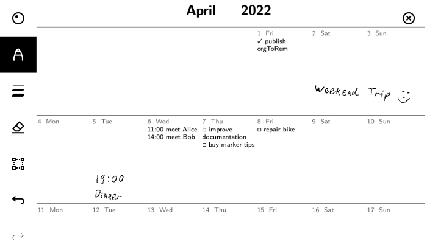
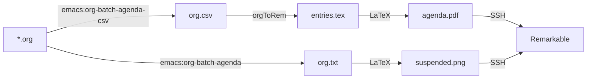

# `orgToRem`

A mix of Haskell and LaTeX to get an [Org Mode](https://orgmode.org/) agenda on the [Remarkable](https://remarkable.com/) tablet.

## Example

```
Week-agenda (W14):
Monday      4 April 2022 W14
Tuesday     5 April 2022
Wednesday   6 April 2022
  11:00-13:00 meet Alice
  14:00-18:00 meet Bob
Thursday    7 April 2022
  Deadline: TODO improve documentation
  Deadline: TODO buy marker tips
Friday      8 April 2022
  Deadline: TODO repair bike
Saturday    9 April 2022
Sunday     10 April 2022
```



Handwritten annotations are preserved when the PDF is updated (by reusing the same UUID, see below).
But they are not synced back into your org files, obviously 😉.

## How to

1. Make sure you have the dependencies:

    - Emacs
    - [The Haskell Tool Stack](https://haskellstack.org/)
    - LaTeX (on Debian `sudo apt install texlive-latex-base latexmk` should be enough.)

2. Ensure you can do `ssh remarkable` - see <https://remarkablewiki.com/tech/ssh>.
   Replace `remarkable` with the IP of your remarkable in the `Makefile`, or use `~/.ssh/config`.

3. Read the `Makefile` and understand this flow chart:



4. First-time set up:

    - Adjust the path `~/Org/*.org` in the `Makefile` to refer to your `.org` files.
    - run `make tex/agenda.pdf` to generate the PDF file.
    - Use [pdf2remakrable.sh](https://github.com/adaerr/reMarkableScripts/blob/master/pdf2remarkable.sh) to copy `tex/agenda.pdf` to your remarkable for the first time.
    - Write the UUID that was used in the previous step into a file called `agenda-uuid.txt`.

5. Regular usage: run `make` to update just the agenda PDF, or `make copy-all` to also overwrite the suspend screen.

## Inspired by

- https://github.com/klimeryk/recalendar
